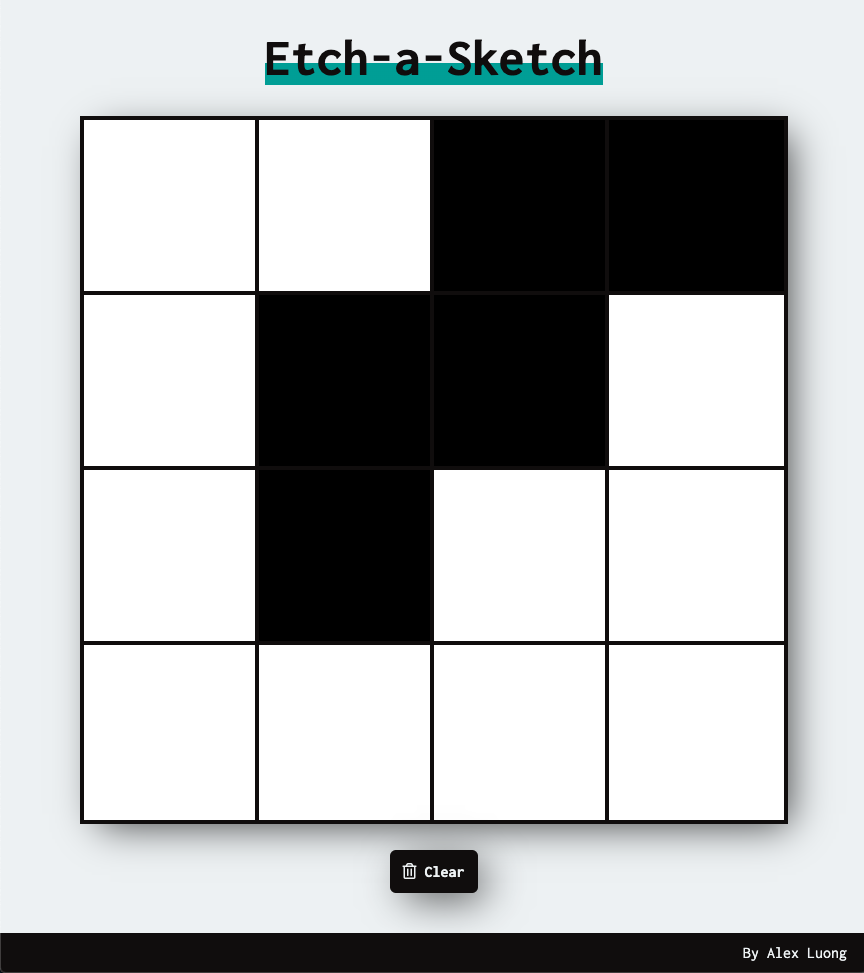

# etch-a-sketch

A small application which simulates an etch-a-sketch. Highlight over the blocks you want to color black. Click 'Clear' to reset the grid and choose the new grid size. Inspired by the [Odin Project](https://www.theodinproject.com/courses/web-development-101/lessons/etch-a-sketch-project).

## Preview

